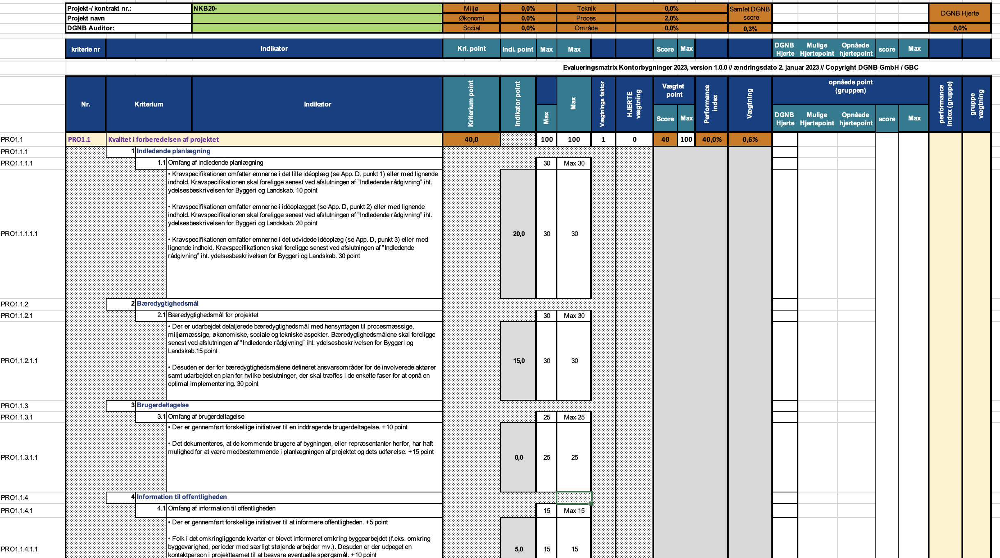

# Criteria Tree Protocol

## Examples
### DGNB2023
The following example is for the NKB/PRO1.1 criteria of DGNB 2023. It is intended to show the following represented
in our schema:
- Point data
- Spreadsheet-calculated global results
- Spreadsheet-calculated per-task group results

A request is made to retrieve the metadata:
```
GET /1/1.0.0/b018ed4a-4fb9-4bc8-989e-5f003cbf5d45
```

Which results in [this metadata schema](metadata.json).

The user then makes a request to retrieve the criteria tree without any parameters:

```
POST /1/1.0.0/b018ed4a-4fb9-4bc8-989e-5f003cbf5d45
```
```json5
{
  "values": {
    "6319f7e3-7fb9-458b-a75b-a65ad72505cd": 20, // PRO1.1.1.1.1 - the value is used as the ID, if the definition had an "ID" property, it should have been used instead
    "d535c0ff-83b4-4008-922d-2d29b6f709e6": 15, // PRO1.2.1.1.1 - the value is used as the ID, if the definition had an "ID" property, it should have been used instead
    "907ebf7d-d13b-4036-9c3a-1cbea03d4694": 5 // PRO1.4.1.1.1 - the value is used as the ID, if the definition had an "ID" property, it should have been used instead
  }
}
```

The resulting response is [this criteria tree schema](criteria-tree.json). It represents
the fraction of the spreadsheet (sheet NKB) that the example pertains to:



Note the `result` property which contains all the calculated values on the top part of the spreadsheet
(in orange), and the `calculatedData` property of task group `PRO1.1` which was calculated by the sheet
and passed alongside the data.
